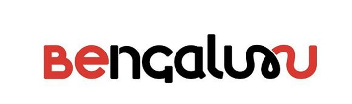

# ProtoSchool Bangalore

Welcome to the Bangalore chapter of [ProtoSchool](https://proto.school)!

We are a group of people passionate about the decentralized web and excited to learn, teach, and share ideas. Everyone is welcome!

## First things First
- Join mailing list of ProtoSchool Bangalore [here](https://goo.gl/forms/lSoxDy50ZoBGDjvN2)
<!-- Join [ProtoSchool meetup group](https://www.meetup.com/Decentralized-Web-ProtoSchool-Meetup/) to get updates on upcoming meetup --> 
- Watch this repo

## What can you do

- Start reading the tutorials of [ProtoSchool](https://proto.school/#/tutorials)
- Discuss your issue(doubts related to distributed web) on this repo (or [IPFS forum](https://discuss.ipfs.io/)). Just create an issue. Issues are cheap.
- Attend our meetups

 If you want to provide space for any month's ProtoSchool meetup, contact Kishan or comment on this [issue](https://github.com/ProtoSchool/bangalore/issues/4)

## Organizers

Our chapter's leadership team includes:
* Kishan Sagathiya ([EMail](mailto:kishansagathiya@gmail.com), [GitHub](https://github.com/kishansagathiya), [Twitter](http://twitter.com/kishansagathiya))

We are looking for more organizers for this chapter. If you want to help organize the chapter(you are most welcome to do so) contact Kishan.

## Code of Conduct

In the interest of fostering an open and welcoming environment, we as
contributors and maintainers pledge to making participation in our project and
our community a harassment-free experience for everyone.

By participating in this project (online and at live chapter events) you agree to abide by its [Code of Conduct](./CODE_OF_CONDUCT.md).

## License

ProtoSchool is licensed under the Apache-2.0 and MIT licenses. See [LICENSE.md](https://github.com/protoschool/seattle/blob/master/LICENSE.md) for further detail.

